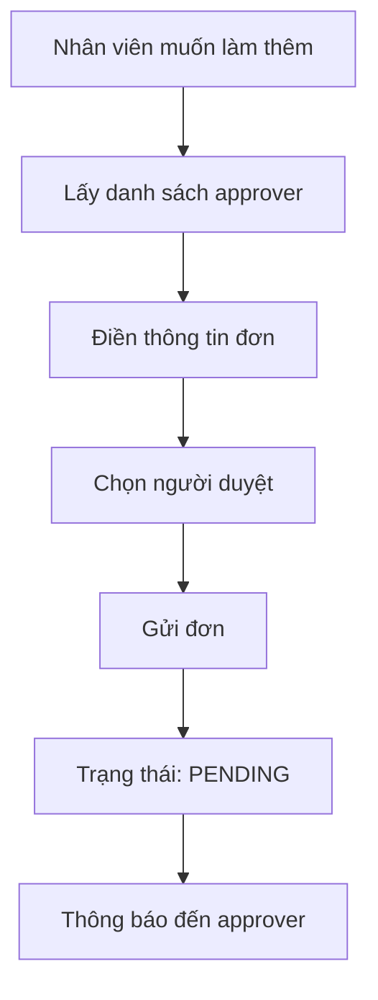
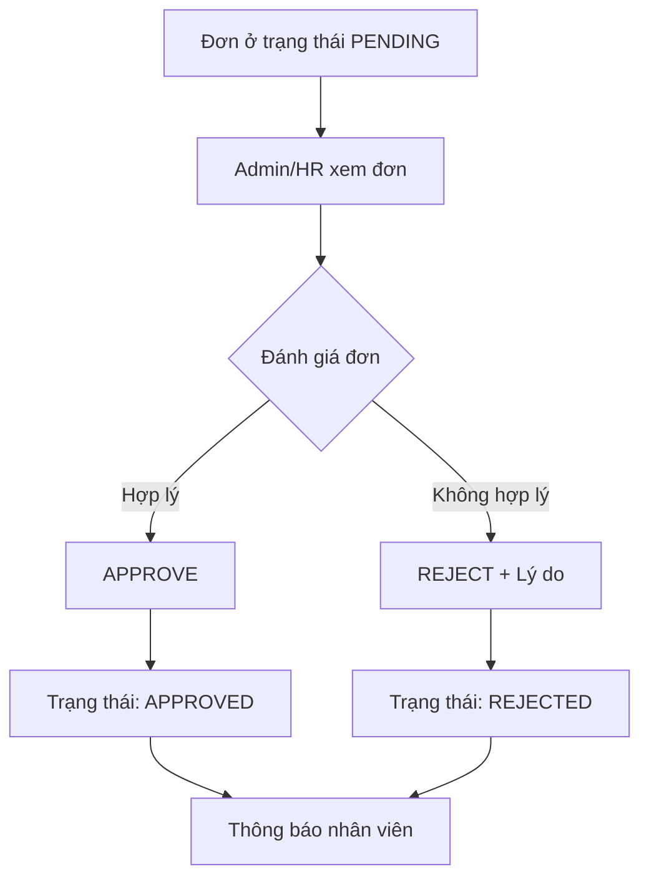

# 📋 Hướng Dẫn API Quản Lý Làm Thêm Giờ (Overtime)

## 🎯 Tổng Quan

API Overtime Management cung cấp đầy đủ chức năng quản lý đơn xin làm thêm giờ trong hệ thống HR, bao gồm:

- **Nhân viên**: Gửi, chỉnh sửa, hủy đơn xin làm thêm giờ
- **Admin/HR/Manager**: Duyệt, từ chối đơn với quy trình nghiệp vụ rõ ràng
- **Chọn người duyệt**: Nhân viên có thể chọn người cụ thể để duyệt đơn

## 🔐 Xác Thực (Authentication)

Tất cả API đều yêu cầu JWT token trong header:

```bash
Authorization: Bearer YOUR_JWT_TOKEN
```

**Cách lấy token:**
1. Đăng nhập: `POST /api/auth/login`
2. Sử dụng token từ response cho các API khác

## 🏗️ Cấu Trúc Nghiệp Vụ

### 📝 Quy Trình Gửi Đơn (Employee)



### ✅ Quy Trình Duyệt Đơn (Admin/HR)



## 🚀 Hướng Dẫn Sử Dụng API

### 1. 👥 Lấy Danh Sách Người Duyệt

```bash
GET /api/overtime/approvers
```

**Mục đích:** Lấy danh sách admin/hr/manager để nhân viên chọn người duyệt đơn

**Response:**
```json
{
  "success": true,
  "message": "Approvers retrieved successfully",
  "data": [
    {
      "_id": "60d5ecb74b24a1234567890a",
      "fullname": "Nguyễn Thị B",
      "department": "Human Resources",
      "position": "HR Manager",
      "email": "hr.manager@company.com",
      "role": {
        "_id": "60d5ecb74b24a1234567890f",
        "name": "hr"
      }
    }
  ]
}
```

### 2. 📤 Gửi Đơn Xin Làm Thêm Giờ

```bash
POST /api/overtime/submit
```

**Body:**
```json
{
  "date": "2024-01-15",
  "startTime": "2024-01-15T18:00:00Z",
  "endTime": "2024-01-15T22:00:00Z",
  "reason": "Hoàn thành dự án khẩn cấp cho khách hàng ABC",
  "type": "regular",
  "approverId": "60d5ecb74b24a1234567890a"
}
```

**Các loại overtime:**
- `regular`: Làm thêm giờ thường (sau giờ hành chính)
- `weekend`: Làm thêm cuối tuần
- `holiday`: Làm thêm ngày lễ

**Lưu ý nghiệp vụ:**
- Giờ kết thúc phải sau giờ bắt đầu
- Không được trùng ngày với đơn đã có (pending/approved)
- Nếu không chọn `approverId`, đơn sẽ gửi đến tất cả admin/HR

### 3. 📊 Xem Tóm Tắt Overtime

```bash
GET /api/overtime/summary
```

**Response:**
```json
{
  "success": true,
  "data": {
    "thisMonthHours": 24.5,
    "thisWeekHours": 8.0,
    "pendingRequests": 2,
    "approvedRequests": 5,
    "rejectedRequests": 1,
    "totalHoursThisYear": 120.5
  }
}
```

### 4. 📋 Xem Lịch Sử Overtime

```bash
GET /api/overtime/history?page=1&limit=10&status=pending
```

**Query Parameters:**
- `page`: Trang (mặc định: 1)
- `limit`: Số item/trang (mặc định: 10)
- `status`: Lọc theo trạng thái (`pending`, `approved`, `rejected`)

### 5. ✅ Duyệt Đơn (Admin/HR)

```bash
PUT /api/overtime/admin/{requestId}/approve
```

**Quyền hạn:** Chỉ admin, hr, manager
**Nghiệp vụ:** 
- Chỉ duyệt được đơn ở trạng thái `pending`
- Lưu thông tin người duyệt và thời gian
- Gửi thông báo đến nhân viên

### 6. ❌ Từ Chối Đơn (Admin/HR)

```bash
PUT /api/overtime/admin/{requestId}/reject
```

**Body:**
```json
{
  "rejectionReason": "Lý do làm thêm giờ không đủ thuyết phục. Công việc này có thể hoàn thành trong giờ hành chính."
}
```

**Lưu ý:** Bắt buộc phải có lý do từ chối để nhân viên hiểu rõ

### 7. 📑 Xem Tất Cả Đơn (Admin/HR)

```bash
GET /api/overtime/admin/all?page=1&limit=10&status=pending
```

**Response có pagination:**
```json
{
  "success": true,
  "data": {
    "requests": [...],
    "pagination": {
      "page": 1,
      "limit": 10,
      "total": 50,
      "totalPages": 5
    }
  }
}
```

## 🎯 Các Trường Hợp Sử Dụng Thực Tế

### Scenario 1: Nhân viên làm thêm giờ thường
```bash
# 1. Lấy danh sách approver
GET /api/overtime/approvers

# 2. Gửi đơn làm thêm 4 tiếng
POST /api/overtime/submit
{
  "date": "2024-01-15",
  "startTime": "2024-01-15T18:00:00Z",
  "endTime": "2024-01-15T22:00:00Z",
  "reason": "Hoàn thành báo cáo tháng",
  "type": "regular",
  "approverId": "hr_manager_id"
}
```

### Scenario 2: HR duyệt đơn
```bash
# 1. Xem danh sách đơn chờ duyệt
GET /api/overtime/admin/all?status=pending

# 2. Xem chi tiết đơn
GET /api/overtime/{requestId}

# 3. Duyệt đơn
PUT /api/overtime/admin/{requestId}/approve
```

### Scenario 3: HR từ chối đơn
```bash
# Từ chối với lý do cụ thể
PUT /api/overtime/admin/{requestId}/reject
{
  "rejectionReason": "Ngân sách overtime tháng này đã hết. Vui lòng sắp xếp công việc trong giờ hành chính."
}
```

## 🔍 Test API với Swagger

1. Mở file: `docs/overtime-swagger.html`
2. Click "Authorize" và nhập: `Bearer YOUR_TOKEN`
3. Test các endpoint với dữ liệu mẫu có sẵn

## ⚠️ Lưu Ý Quan Trọng

### Quy Tắc Nghiệp Vụ:
- Một nhân viên chỉ có thể có 1 đơn/ngày (pending hoặc approved)
- Chỉ đơn `pending` mới có thể chỉnh sửa/hủy/duyệt
- Đơn đã `approved` sẽ tính vào lương overtime
- Đơn `rejected` không tính lương và có thể gửi đơn mới

### Phân Quyền:
- **Employee**: Gửi, sửa, hủy đơn của mình
- **Manager**: Duyệt đơn của nhân viên trong team
- **HR**: Duyệt tất cả đơn
- **Admin**: Toàn quyền

### Validation:
- Thời gian: endTime > startTime
- Lý do: Tối thiểu 10 ký tự
- Ngày: Không được quá xa trong tương lai
- Trùng lặp: Kiểm tra đơn cùng ngày

## 🐛 Troubleshooting

### Lỗi 400 - Bad Request
- Kiểm tra format ngày giờ (ISO 8601)
- Đảm bảo endTime > startTime
- Kiểm tra lý do đủ dài

### Lỗi 401 - Unauthorized
- Token hết hạn hoặc không hợp lệ
- Đăng nhập lại để lấy token mới

### Lỗi 403 - Forbidden
- Không có quyền thực hiện action
- Kiểm tra role của user

### Lỗi 404 - Not Found
- RequestId không tồn tại
- Đơn đã bị xóa hoặc không thuộc về user
