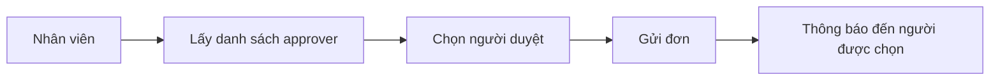

# 🚀 Cải Tiến Hệ Thống Overtime Management

## 📋 Tổng Quan Cải Tiến

Đã hoàn thiện hệ thống quản lý làm thêm giờ với **Swagger documentation chi tiết** và **nghiệp vụ chọn người duyệt đơn** theo đúng yêu cầu.

## ✨ Các Tính Năng Mới

### 1. 🎯 Chọn Người Duyệt Đơn (Approver Selection)

**Trước đây:** Đơn được gửi đến tất cả admin/HR
**Bây giờ:** Nhân viên có thể chọn người cụ thể để duyệt đơn

#### Quy trình mới:


#### API mới:
- `GET /api/overtime/approvers` - Lấy danh sách người có thể duyệt
- `POST /api/overtime/submit` - Có thêm field `approverId`

### 2. 📚 Swagger Documentation Hoàn Chỉnh

**Đặc điểm:**
- ✅ Miêu tả chi tiết từng endpoint bằng tiếng Việt
- ✅ Giải thích rõ nghiệp vụ và quy trình
- ✅ Ví dụ request/response cụ thể
- ✅ Các trường hợp lỗi và cách xử lý
- ✅ Examples cho từng loại overtime

#### Nội dung documentation:
- **Chức năng:** Mô tả rõ endpoint làm gì
- **Nghiệp vụ:** Giải thích quy trình business logic
- **Lưu ý:** Các điều kiện và ràng buộc
- **Ví dụ:** Request/response mẫu thực tế

### 3. 🔧 Cải Tiến Database Schema

**Thêm field mới:**
```typescript
// overtime.ts model
assignedApproverId?: mongoose.Types.ObjectId; // Người được chỉ định duyệt
approvedBy?: mongoose.Types.ObjectId;         // Người thực sự duyệt
```

**Lợi ích:**
- Theo dõi được ai được chỉ định duyệt
- Phân biệt người được chỉ định vs người thực sự duyệt
- Audit trail đầy đủ

### 4. 🎨 Tools Hỗ Trợ Test API

#### A. Swagger UI (`overtime-api.yaml`)
- OpenAPI 3.0 specification
- Interactive documentation
- Try-it-out functionality

#### B. HTML Test Tool (`test-overtime-api.html`)
- Giao diện thân thiện
- Test tất cả endpoint
- Không cần Postman

#### C. Hướng dẫn chi tiết (`OVERTIME_API_GUIDE.md`)
- Quy trình nghiệp vụ
- Ví dụ thực tế
- Troubleshooting

## 🏗️ Cấu Trúc Files Mới

```
Golder_HR_Backend/
├── docs/
│   ├── overtime-api.yaml           # Swagger specification
│   ├── test-overtime-api.html      # HTML test tool
│   ├── OVERTIME_API_GUIDE.md       # Hướng dẫn sử dụng
│   └── OVERTIME_IMPROVEMENTS.md    # File này
├── src/
│   ├── controllers/
│   │   └── overtimeController.ts   # Đã thêm Swagger docs
│   ├── services/
│   │   └── overtimeService.ts      # Thêm getApprovers()
│   ├── models/
│   │   └── overtime.ts             # Thêm assignedApproverId
│   └── routes/
│       └── overtimeRoutes.ts       # Thêm route /approvers
```

## 🎯 Nghiệp Vụ Được Cải Thiện

### 1. Quy Trình Gửi Đơn Mới

**Bước 1:** Lấy danh sách approver
```bash
GET /api/overtime/approvers
```

**Bước 2:** Chọn approver và gửi đơn
```bash
POST /api/overtime/submit
{
  "date": "2024-01-15",
  "startTime": "2024-01-15T18:00:00Z",
  "endTime": "2024-01-15T22:00:00Z",
  "reason": "Hoàn thành dự án khẩn cấp",
  "type": "regular",
  "approverId": "60d5ecb74b24a1234567890a"  // ← Mới
}
```

### 2. Quy Trình Duyệt Đơn

**Admin/HR có thể:**
- Xem tất cả đơn: `GET /api/overtime/admin/all`
- Duyệt đơn: `PUT /api/overtime/admin/{id}/approve`
- Từ chối với lý do: `PUT /api/overtime/admin/{id}/reject`

### 3. Phân Quyền Rõ Ràng

| Vai trò | Quyền hạn |
|---------|-----------|
| **Employee** | Gửi, sửa, hủy đơn của mình |
| **Manager** | Duyệt đơn của team |
| **HR** | Duyệt tất cả đơn |
| **Admin** | Toàn quyền |

## 📊 Swagger Documentation Highlights

### Endpoint Submit Overtime
```yaml
summary: Gửi đơn xin làm thêm giờ
description: |
  **Chức năng:** Nhân viên gửi đơn xin làm thêm giờ với đầy đủ thông tin và chọn người duyệt
  
  **Nghiệp vụ:**
  - Nhân viên điền thông tin: ngày, giờ bắt đầu, giờ kết thúc, lý do làm thêm
  - Chọn loại overtime: regular (thường), weekend (cuối tuần), holiday (ngày lễ)
  - **Chọn người duyệt đơn:** Có thể chọn manager, HR hoặc admin cụ thể để duyệt đơn
  - Hệ thống tự động tính số giờ làm thêm
  - Kiểm tra không được trùng lặp đơn trong cùng ngày
  - Trạng thái mặc định: "pending" (chờ duyệt)
  - Gửi thông báo đến người được chọn để duyệt đơn
```

### Response Examples
```json
{
  "success": true,
  "message": "Overtime request submitted successfully",
  "data": {
    "_id": "60d5ecb74b24a1234567890d",
    "employeeId": "60d5ecb74b24a1234567890e",
    "employeeName": "Nguyễn Văn A",
    "date": "2024-01-15",
    "startTime": "2024-01-15T18:00:00Z",
    "endTime": "2024-01-15T22:00:00Z",
    "hours": 4,
    "reason": "Hoàn thành dự án khẩn cấp",
    "type": "regular",
    "status": "pending",
    "assignedApproverId": "60d5ecb74b24a1234567890a",
    "createdAt": "2024-01-15T17:30:00Z"
  }
}
```

## 🚀 Cách Sử Dụng

### 1. Test với Swagger UI
```bash
# Mở browser và truy cập:
file:///path/to/docs/overtime-swagger.html
```

### 2. Test với HTML Tool
```bash
# Mở file:
docs/test-overtime-api.html
```

### 3. Đọc hướng dẫn
```bash
# Xem file:
docs/OVERTIME_API_GUIDE.md
```

## ✅ Checklist Hoàn Thành

- [x] ✅ Thêm chức năng chọn người duyệt đơn
- [x] ✅ API lấy danh sách approvers
- [x] ✅ Cập nhật database schema
- [x] ✅ Swagger documentation chi tiết bằng tiếng Việt
- [x] ✅ Miêu tả rõ nghiệp vụ từng endpoint
- [x] ✅ Ví dụ request/response cụ thể
- [x] ✅ HTML test tool thân thiện
- [x] ✅ Hướng dẫn sử dụng đầy đủ
- [x] ✅ Troubleshooting guide

## 🎉 Kết Quả

**Trước:** API cơ bản, thiếu documentation, nghiệp vụ đơn giản
**Sau:** API hoàn chỉnh với Swagger docs chi tiết, nghiệp vụ chọn approver, tools test đầy đủ

Giờ đây bạn có thể:
1. **Test API dễ dàng** với Swagger UI hoặc HTML tool
2. **Hiểu rõ nghiệp vụ** qua documentation chi tiết
3. **Implement frontend** dựa trên specs rõ ràng
4. **Chọn người duyệt** theo đúng quy trình công ty
